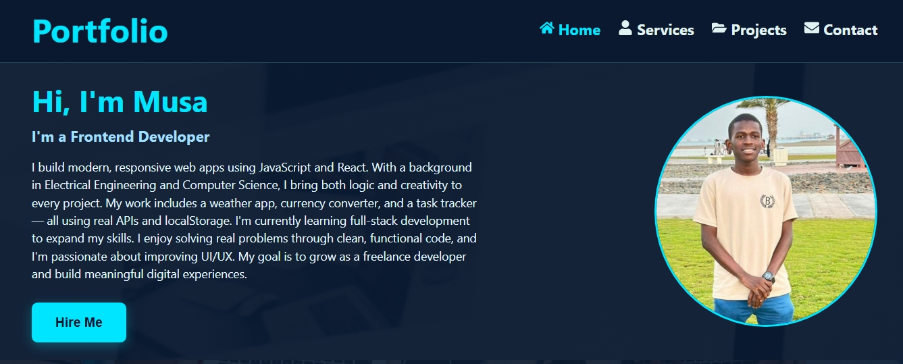
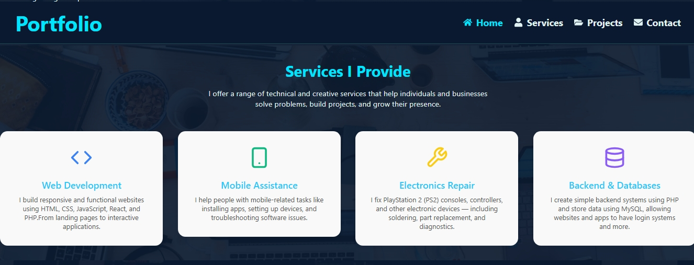
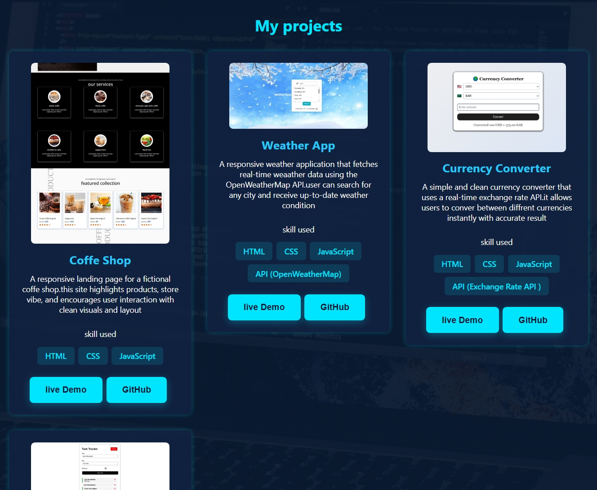
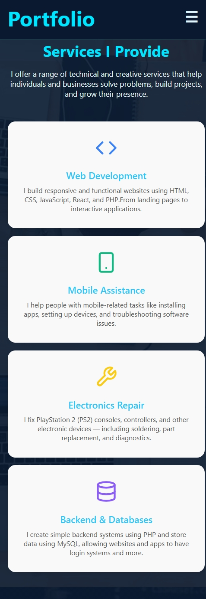
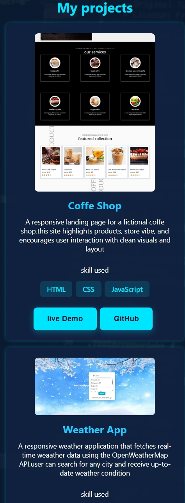

# 💼 Musa's Developer Portfolio

A modern, responsive developer portfolio built with **React**, showcasing my skills, projects, and contact information. Designed to highlight both frontend and backend development capabilities in a sleek, professional layout.

## 🚀 Live Demo

[🌐 Visit My Portfolio](https://your-deployed-site-link)  
---

## 📸 Screenshots

### 🖥️ Desktop View

#### Hero Section

#### Services Section

#### projects section

---

### 📱 Mobile View
#### Hero Section

#### Services Section

#### projects section

---

## ✨ Features

- ✅ Responsive design for all screen sizes
- 🙋 About Me section with image and short bio
- 🛠️ Services section showcasing what I offer
- 📁 Projects grid with tech stacks used
- 🧠 Skills cards with animated progress circles
- 📨 Contact form (ready for integration)
- 💫 Smooth animations and clean UI

---

## 🛠️ Tech Stack

- ⚛️ **React**
- 🔁 **React Hooks**
- 🧠 **JavaScript (ES6+)**
- 🧱 **HTML5 & CSS3**
- 🧩 **Flexbox & Grid**
- 🌄 **Unsplash API** (for backgrounds)

---

## 🧠 What I Learned

- Efficient component structuring with **React**
- Using **Hooks** for state and side-effects
- CSS layout mastery: **Flexbox** and **Grid**
- Making reusable and interactive UI components
- Adding smooth transitions and animations
- Building a **professional developer brand** through a portfolio

---

## 📂 Folder Structure

portofolio/
├── public/
├── src/
│ ├── components/
│ ├── assets/
│ ├── App.js
│ └── index.js
├── .gitignore
├── package.json
└── README.md

---

## 📝 Setup Instructions

1. **Clone the repository**

git clone https://github.com/Mousacr7/portofolio.git
cd portofolio
Install dependencies

npm install
Start the app locally

npm start
📧 Contact
If you'd like to collaborate or have any questions, feel free to reach out:

📩 Email: mosamlam389@gmail.com

💻 GitHub: Mousacr7

🏆 License
This project is open-source and available under the MIT License.
